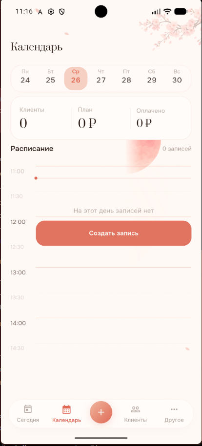
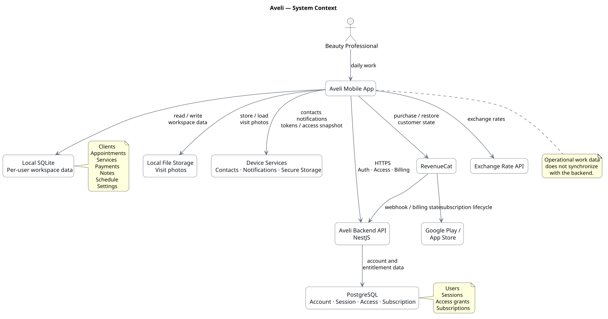
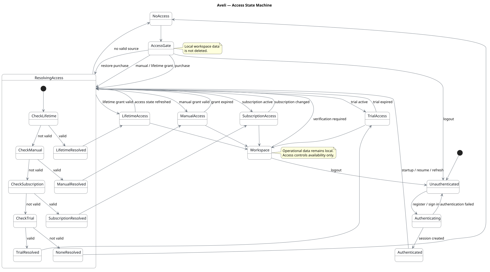
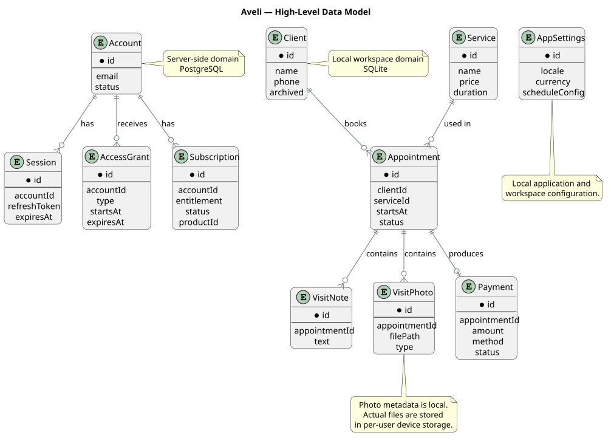
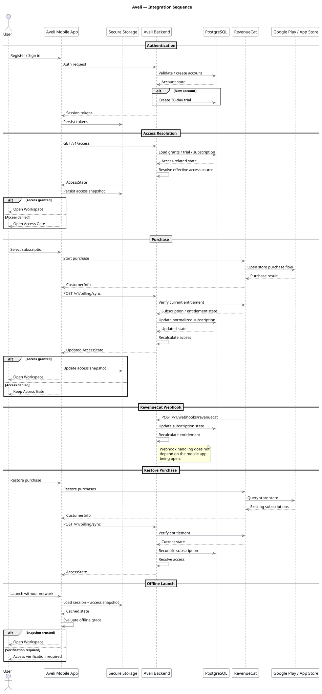

<p align="center">
  
</p>

<p align="center">
  <a href="README.md">English</a> ·
  <a href="README.ru.md"><b>Русский</b></a>
</p>

<p align="center">
  <strong>Мобильное рабочее пространство для независимых специалистов индустрии красоты с local-first хранением данных, серверным управлением доступом и подписочной моделью.</strong>
</p>

<p align="center">
  <code>Системный анализ</code>
  <code>Мобильная архитектура</code>
  <code>Offline-first</code>
  <code>REST API</code>
  <code>Владение данными</code>
  <code>Интеграция биллинга</code>
</p>

---

## Что такое Aveli?

**Aveli** — мобильное рабочее пространство для ежедневной работы независимых специалистов индустрии красоты.

Приложение помогает управлять:

- записями и ежедневным расписанием;
- клиентами и историей визитов;
- услугами и ценами;
- оплатами и задолженностями;
- заметками и фотографиями визитов;
- напоминаниями и настройками профиля.

Продукт намеренно спроектирован как лёгкая альтернатива тяжёлым CRM-системам.

Основная архитектурная идея проста:

```text
Рабочие данные
      ↓
   Устройство

Identity / Access / Billing
      ↓
    Backend
```

Данные клиентов, записей и оплат остаются на устройстве, а backend управляет идентификацией пользователя, trial-периодом, подпиской и правами доступа.

---

## Экраны продукта

<table>
<tr>
<td width="50%" align="center">
  
  <br>
  <sub><b>Сегодня</b> — ежедневное расписание и обзор рабочего пространства</sub>
</td>
<td width="50%" align="center">
  
  <br>
  <sub><b>Календарь</b> — записи и планирование дня</sub>
</td>
</tr>
<tr>
<td width="50%" align="center">
  
  <br>
  <sub><b>Клиенты</b> — справочник клиентов и история взаимодействий</sub>
</td>
<td width="50%" align="center">
  
  <br>
  <sub><b>Рабочее пространство</b> — вспомогательный пользовательский сценарий приложения</sub>
</td>
</tr>
</table>

---

## Системная проблема

В Aveli существуют две принципиально разные области ответственности.

Первая — непосредственная рабочая деятельность пользователя:

```text
Клиенты
Записи
Услуги
Оплаты
Заметки
Фотографии
Расписание
```

Вторая — коммерческая и учетная инфраструктура:

```text
Аутентификация
Trial
Подписка
Права доступа
Биллинг
```

Если смешать эти области, ежедневная работа пользователя станет зависимой от доступности сети, а чувствительные клиентские данные будут без необходимости перенесены в backend-инфраструктуру.

Поэтому решение строится вокруг чёткой системной границы.

---

## Решение

<table>
<tr>
<td width="50%" valign="top">

### Локальное рабочее пространство

На устройстве пользователя хранятся:

- Клиенты
- Записи
- Услуги
- Оплаты
- Заметки по визитам
- Фотографии визитов
- Расписание
- Локальные настройки

**Хранилище:** Drift / SQLite + файлы устройства

</td>
<td width="50%" valign="top">

### Аккаунт и доступ

Backend управляет:

- Пользовательскими аккаунтами
- Сессиями
- Состоянием trial
- Ручными правами доступа
- Lifetime-доступом
- Состоянием подписки
- Синхронизацией биллинга

**Хранилище:** PostgreSQL

</td>
</tr>
</table>

Backend определяет, **может ли пользователь открыть рабочее пространство**.

При этом он не становится источником истины для профессиональных данных пользователя.

---

## Высокоуровневая архитектура

<p align="center">
  
</p>

```text
Flutter Application
        │
        ├── Local Workspace ──────→ Drift / SQLite
        │                           Local Files
        │
        └── Account & Access ─────→ NestJS API
                                      │
                                      ├── PostgreSQL
                                      │
                                      └── RevenueCat
                                             │
                                   Google Play / App Store
```

---

## Ключевые системные решения

### 01 · Local-first рабочее пространство

Ежедневная работа остаётся доступной без постоянного подключения к backend.

Приложение читает и записывает операционные данные напрямую в локальное хранилище.

### 02 · Изоляция данных между пользователями

Каждый аутентифицированный аккаунт имеет собственную локальную базу данных:

```text
aveli_<userId>.sqlite
```

Фотографии визитов используют тот же принцип владения и изоляции по пользователю.

### 03 · Trial под управлением сервера

30-дневный trial создаётся на backend.

Это означает:

```text
Logout      ─┐
Reinstall   ├─→ не сбрасывают trial
Clear data  ─┘
```

Источником истины остаётся серверный аккаунт.

### 04 · Единый Access Gate

Рабочее пространство либо доступно целиком, либо заблокировано целиком.

```text
Lifetime
   ↓
Manual Grant
   ↓
Subscription
   ↓
Trial
   ↓
None
```

Приложение не распределяет отдельные premium-проверки по экранам.

### 05 · Доступ не владеет данными

Окончание trial или подписки блокирует доступ к рабочему пространству.

При этом система **не удаляет**:

- клиентов;
- записи;
- оплаты;
- заметки;
- фотографии.

После восстановления доступа то же локальное рабочее пространство становится доступно снова.

### 06 · Контролируемая работа offline

Доверенный snapshot состояния доступа хранится в secure storage.

Это позволяет временно работать без сети, сохраняя за сервером роль доверенного источника entitlement-состояния.

```text
Последняя проверка доступа
        ↓
Secure snapshot
        ↓
Offline grace
        ↓
Требуется повторная проверка
```

### 07 · Биллинг через entitlement-модель

Aveli не основывает доступ на клиентском флаге вроде `isPremium`.

```text
Google Play / App Store
          ↓
      RevenueCat
          ↓
     Aveli Backend
          ↓
     Access Decision
```

Месячный и годовой планы отображаются в один логический entitlement:

```text
support
```

---

## Модель состояния доступа

<p align="center">
  
</p>

Слой доступа определяет один эффективный источник доступа и на его основе решает, может ли пользователь открыть рабочее пространство.

Это объединяет trial, подписку и ручные права доступа в одну детерминированную модель.

---

## Модель данных

<p align="center">
  
</p>

Ключевое различие заключается не только в связях между сущностями, но и во **владении данными**:

```text
SERVER DOMAIN
Account
Session
Access
Subscription

        │ контролирует доступность
        ▼

LOCAL DOMAIN
Client
Service
Appointment
Payment
Visit Notes
Visit Photos
Schedule
```

---

## Поток интеграций

<p align="center">
  
</p>

Основной интеграционный контур включает:

- аутентификацию;
- разрешение доступа;
- синхронизацию биллинга;
- RevenueCat webhooks;
- восстановление покупок;
- offline fallback.

Ключевые backend endpoints:

```text
/v1/auth/*
GET  /v1/access
POST /v1/billing/sync
POST /v1/webhooks/revenuecat
```

---

## Процесс разработки

Продукт разрабатывался от системных границ внутрь, а не от отдельных экранов.

```text
Идея продукта
    ↓
Пользовательские сценарии
    ↓
Доменная модель
    ↓
Владение данными
    ↓
Аутентификация и доступ
    ↓
Внешние интеграции
    ↓
Offline-поведение
    ↓
Безопасность и release-ограничения
    ↓
Реализация
    ↓
Автоматизированная проверка
```

Наиболее важные решения принимались в точках соприкосновения разных областей:

- локальные данные vs backend-данные;
- аутентификация vs entitlement;
- состояние подписки vs доступ к рабочему пространству;
- кэшированный доступ vs серверный источник истины;
- гибкость разработки vs безопасность production.

---

## Артефакты системного анализа

| Область | Документация |
|---|---|
| Контекст и Scope | [`01-Context-and-Scope`](01-Context-and-Scope/) |
| Пользовательские сценарии | [`02-User-Journey`](02-User-Journey/) |
| Требования | [`03-Requirements`](03-Requirements/) |
| Проектирование системы | [`04-System-Design`](04-System-Design/) |
| Данные и домен | [`05-Data-and-Domain`](05-Data-and-Domain/) |
| Аутентификация и доступ | [`06-Auth-and-Access`](06-Auth-and-Access/) |
| Интеграции | [`07-Integrations`](07-Integrations/) |
| Offline и обработка ошибок | [`08-Offline-and-Error-Handling`](08-Offline-and-Error-Handling/) |
| Безопасность и Release | [`09-Security-and-Release`](09-Security-and-Release/) |
| Трассируемость | [`10-Traceability`](10-Traceability/) |
| Результат | [`11-Result`](11-Result/) |

---

## Набор диаграмм

В репозитории хранятся отрендеренные диаграммы для быстрого просмотра:

```text
renderer/
├── user-flow.svg
├── system-context.svg
├── component-model.svg
├── data-model.svg
├── access-sequence.svg
├── access-state-machine.svg
└── integration-sequence.svg
```

Исходные `.puml`-файлы остаются рядом с соответствующими аналитическими документами.

---

## Технологический стек

<p align="center">
  
  
  
  
  
  
  
  
  
  
</p>

### Client

```text
Flutter
Riverpod
go_router
Drift / SQLite
flutter_secure_storage
purchases_flutter
flutter_local_notifications
```

### Backend

```text
NestJS
Prisma
PostgreSQL
Argon2id
JWT access + rotating refresh
RevenueCat REST + webhooks
```

---

## Качество и безопасность релиза

Проект включает автоматизированные проверки для:

- аутентификации и жизненного цикла сессии;
- состояния доступа;
- сценариев подписки;
- правил записей;
- правил оплат;
- миграций базы данных;
- offline-доступа;
- release-конфигурации.

Production-сборки явно отклоняют небезопасные development-конфигурации, например:

```text
localhost
127.0.0.1
10.0.2.2
AVELI_STANDALONE=true
```

---

## Результат

Aveli демонстрирует системный анализ приложения, в котором мобильный UX, локальное хранение данных, backend-идентификация, биллинг и offline-поведение должны оставаться согласованными друг с другом.

Кейс охватывает:

```text
Требования
+
Доменное моделирование
+
Владение данными
+
Мобильная архитектура
+
REST API
+
Аутентификация
+
Entitlement
+
Интеграция биллинга
+
Offline-стратегия
+
Безопасность
+
Release-ограничения
```

Результат — реально реализованный продукт с явными системными границами и трассируемыми архитектурными решениями.

---

<p align="center">
  <strong>Системный анализ, рассчитанный на реальную реализацию.</strong>
</p>
