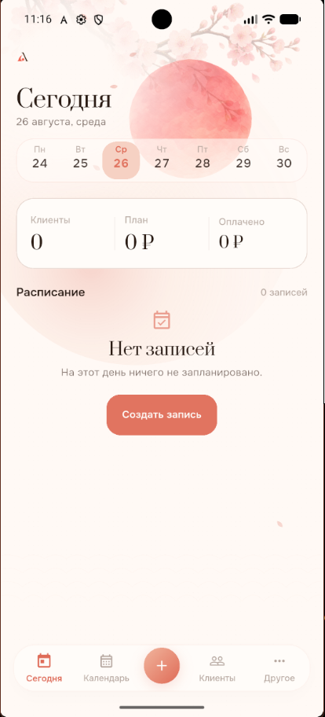
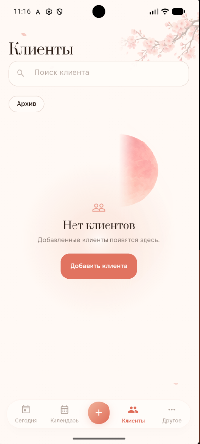
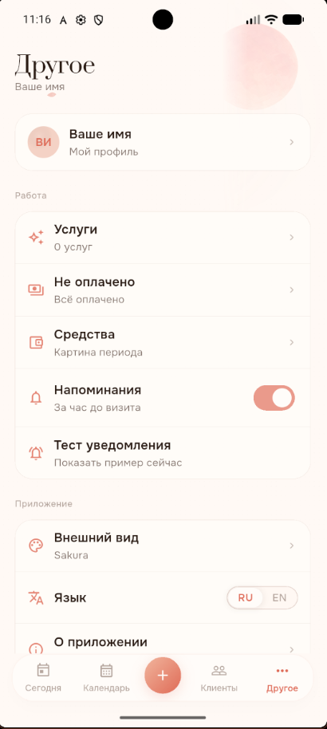

<p align="center">
  
</p>

<p align="center">
  <a href="README.md">Английский</a> ·
  <a href="README.ru.md"><b>Русский</b></a>
</p>

<p align="center">
  <strong>Кейс системного анализа мобильного приложения с локальным хранением профессиональных данных и серверным управлением аккаунтом, доступом и подпиской.</strong>
</p>

<p align="center">
  <code>Системный анализ</code>
  <code>Локальное хранение</code>
  <code>Владение данными</code>
  <code>REST API</code>
  <code>Офлайн-доступ</code>
  <code>Интеграция биллинга</code>
  <code>SSAD</code>
</p>

---

## Что такое Aveli?

**Aveli** — персональное мобильное рабочее пространство для независимых специалистов индустрии красоты.

Приложение помогает вести ежедневную работу с:

- клиентами и историей визитов;
- записями и календарём;
- услугами и ценами;
- оплатами и задолженностями;
- заметками и фотографиями визитов;
- локальными напоминаниями;
- настройками профиля и рабочего пространства.

Продукт намеренно остаётся лёгким. Это не система управления салоном и не CRM, построенная вокруг серверного хранения профессиональных данных.

Главная архитектурная граница:

```text
Профессиональное рабочее пространство
        ↓
   Устройство пользователя

Аккаунт / доступ / биллинг
        ↓
      Бэкенд
```

Профессиональные данные остаются локальными. Идентичность аккаунта, серверные сессии, пробный период, права доступа и нормализованное состояние подписки контролируются бэкендом.

---

## Экраны продукта

<table>
<tr>
<td width="50%" align="center">
  
  <br>
  <sub><b>Сегодня</b> — текущее расписание и рабочий день</sub>
</td>
<td width="50%" align="center">
  
  <br>
  <sub><b>Календарь</b> — записи и планирование дня</sub>
</td>
</tr>
<tr>
<td width="50%" align="center">
  
  <br>
  <sub><b>Клиенты</b> — справочник и история взаимодействий</sub>
</td>
<td width="50%" align="center">
  
  <br>
  <sub><b>Рабочее пространство</b> — дополнительный сценарий продукта</sub>
</td>
</tr>
</table>

---

## Системная задача

Aveli объединяет две области с принципиально разными требованиями к владению данными и доступности.

### Профессиональная работа

```text
Клиенты
Услуги
Записи
Оплаты
Заметки
Фотографии
Расписание
Настройки рабочего пространства
```

Это чувствительные операционные данные, которые должны оставаться полезными даже при временной недоступности сервера.

### Аккаунт и коммерческая инфраструктура

```text
Аутентификация
Сессии
Регистрационный пробный период
Ручные и бессрочные права доступа
Подписка
Сверка биллинга
Доступ к рабочему пространству
```

Для этих решений нужен доверенный серверный источник.

Поэтому текущая архитектура не превращает профессиональные данные в синхронизируемый серверный домен, пока сама граница продукта не изменится.

---

## Высокоуровневая архитектура

<p align="center">
  
</p>

```text
Независимый специалист
        ↓
   Мобильный клиент Aveli
      /            \
     /              \
Локальное           API аккаунта
рабочее пространство и доступа
     ↓                    ↓
SQLite + файлы        Бэкенд Aveli
                           ↓
                    PostgreSQL
                           ↕
                       RevenueCat
                           ↕
                App Store / Google Play
```

Дополнительные внешние границы: контакты устройства, локальные уведомления, камера и галерея, системная передача данных другим приложениям и внешний API обменных курсов.

Полное межуровневое представление системы находится в [`system/`](system/).

---

## Ключевые системные решения

### 01 · Локальное профессиональное рабочее пространство

Обычные профессиональные операции работают напрямую с локальным хранилищем.

```text
Действие пользователя
   ↓
Домен / репозиторий фронтенда
   ↓
Drift / SQLite + локальные файлы
```

Для обычной работы не требуется облачная копия клиентов, записей, оплат, заметок и фотографий.

### 02 · Изоляция рабочего пространства по пользователю

Идентификатор аутентифицированного серверного пользователя выбирает локальное рабочее пространство:

```text
users.id
   ↓
aveli_<userId>.sqlite
```

Фотографии визитов и кэшированный снимок состояния доступа используют ту же пользовательскую границу.

### 03 · Серверное управление доступом

Бэкенд определяет один итоговый источник доступа:

```text
Бессрочный доступ (`lifetime`)
   ↓
Ручное право доступа (`manual`)
   ↓
Подписка (`subscription`)
   ↓
Пробный период (`trial`)
   ↓
Нет доступа (`none`)
```

Фронтенд использует уже рассчитанный результат и не повторяет алгоритм приоритета прав доступа.

### 04 · Доступ не владеет данными

```text
Доступ закончился
      ≠
Удалить рабочее пространство
```

Окончание пробного периода или подписки может заблокировать открытие рабочего пространства, но не удаляет локальные профессиональные данные.

### 05 · Ограниченное доверие в офлайне

Ранее проверенное состояние доступа сохраняется в защищённом хранилище.

```text
Проверка на сервере
      ↓
Доверенный снимок состояния
      ↓
Временное разрешение на офлайн-работу
      ↓
Необходимость повторной проверки
```

Приоритет имеет срок повторной проверки, возвращённый сервером. В текущем клиенте также предусмотрено значение по умолчанию 72 часа для тех случаев, когда сервер не передал более точный срок.

### 06 · Покупка не равна прямому доступу

```text
Покупка в магазине приложений
      ↓
RevenueCat
      ↓
POST /v1/billing/sync
      ↓
Сверка на бэкенде
      ↓
AccessStatusView
      ↓
Проверка доступа во фронтенде
```

Результат покупки в RevenueCat не обходит общую модель доступа Aveli.

### 07 · Выход из аккаунта не равен удалению профиля

Выход очищает активный контекст идентичности и доступа, отменяет пользовательские напоминания и закрывает локальную базу данных, но сохраняет профессиональное рабочее пространство.

Явное удаление профиля — отдельный разрушительный сценарий.

---

## Архитектура документации

Репозиторий организован по рабочей методологии **System-Structured Analysis Documentation (SSAD)**.

Основной принцип:

> **Документация отражает структуру системы.**

Знание принадлежит той части системы, которая действительно отвечает за соответствующее решение.

```text
business/
database/
backend/
frontend/
integrations/
system/
```

Дополнительные области:

```text
screenshots/
renderer/
methodology.md
rules.md
```

### Карта репозитория

| Область | Ответственность |
|---|---|
| [`business/`](business/) | Контекст продукта, границы, требования, бизнес-правила, процессы и трассируемость. |
| [`database/`](database/) | Владение данными, концептуальная и логическая модели, физическое хранение. |
| [`backend/`](backend/) | Аккаунт, аутентификация, доступ, биллинг, API и серверное поведение. |
| [`frontend/`](frontend/) | клиент на Flutter, навигация, состояние, локальное рабочее пространство, офлайн-режим и возможности устройства. |
| [`integrations/`](integrations/) | RevenueCat, магазины приложений, сервисы устройства и сторонние границы. |
| [`system/`](system/) | Межкомпонентный контекст, сквозные сценарии, доверие, инварианты, эволюция и итоговая проверка. |
| [`methodology.ru.md`](methodology.ru.md) | Почему SSAD устроен именно так. |
| [`rules.ru.md`](rules.ru.md) | Нормативные правила документации. |

Иерархия отвечает за владение и навигацию, а перекрёстные ссылки образуют граф знаний.

> **Хранение иерархично. Знание связано графом.**

---

## Рекомендуемые пути чтения

### Быстрый обзор системы

```text
README
  ↓
business/README
  ↓
system/README
  ↓
system/architecture
  ↓
system/flows
  ↓
system/invariants
```

### Бизнес и требования

- [`business/context/`](business/context/)
- [`business/scope/`](business/scope/)
- [`business/requirements/`](business/requirements/)
- [`business/processes/`](business/processes/)
- [`business/traceability/`](business/traceability/)

### Данные

- [`database/architecture/data-ownership.ru.md`](database/architecture/data-ownership.ru.md)
- [`database/models/`](database/models/)
- [`database/local/`](database/local/)
- [`database/server/`](database/server/)

### Бэкенд

- [`backend/architecture/`](backend/architecture/)
- [`backend/api/`](backend/api/)
- [`backend/auth/`](backend/auth/)
- [`backend/access/`](backend/access/)
- [`backend/billing/`](backend/billing/)

### Фронтенд

- [`frontend/architecture/`](frontend/architecture/)
- [`frontend/bootstrap/`](frontend/bootstrap/)
- [`frontend/navigation/`](frontend/navigation/)
- [`frontend/auth/`](frontend/auth/)
- [`frontend/access/`](frontend/access/)
- [`frontend/workspace/`](frontend/workspace/)
- [`frontend/offline/`](frontend/offline/)

### Внешние интеграции

- [`integrations/revenuecat/`](integrations/revenuecat/)
- [`integrations/app-store/`](integrations/app-store/)
- [`integrations/google-play/`](integrations/google-play/)
- [`integrations/device-contacts/`](integrations/device-contacts/)
- [`integrations/device-notifications/`](integrations/device-notifications/)
- [`integrations/device-media/`](integrations/device-media/)
- [`integrations/exchange-rate/`](integrations/exchange-rate/)

### Итоговая проверка системы

- [`system/trust/`](system/trust/)
- [`system/invariants/`](system/invariants/)
- [`system/evolution/`](system/evolution/)
- [`system/review/failure-scenarios.ru.md`](system/review/failure-scenarios.ru.md)
- [`system/review/release-readiness.ru.md`](system/review/release-readiness.ru.md)
- [`system/review/open-questions.ru.md`](system/review/open-questions.ru.md)

---

## Технологический стек

Стек сгруппирован по зонам ответственности, а не представлен плоским списком зависимостей.

<table>
<tr>
<td width="50%" valign="top">

### Мобильное приложение

<p>
  
  
  
  
</p>

```text
Flutter / Dart
Riverpod
go_router
```

Отвечает за:

```text
интерфейс
навигацию
состояние приложения
поведение локального рабочего пространства
проверку доступа
офлайн-поведение клиента
```

</td>
<td width="50%" valign="top">

### Локальные данные и устройство

<p>
  
  
  
  
</p>

```text
Drift
SQLite
flutter_secure_storage
flutter_local_notifications
локальная файловая система
```

Отвечает за:

```text
хранение профессионального рабочего пространства
изоляцию пользователей
файлы фотографий визитов
доверенный снимок состояния доступа
локальные напоминания
```

</td>
</tr>

<tr>
<td width="50%" valign="top">

### Бэкенд

<p>
  
  
  
  
</p>

```text
NestJS
Prisma
токены доступа JWT
ротируемые токены обновления
Argon2id
REST API
```

Отвечает за:

```text
идентичность
аутентификацию
сессии
пробный период и права доступа
определение итогового доступа
сверку биллинга
```

</td>
<td width="50%" valign="top">

### Серверные данные

<p>
  
  
  
</p>

```text
PostgreSQL
миграции Prisma
OpenAPI
```

Хранит:

```text
пользователей
серверные сессии
права доступа
состояние подписок
события подписок
```

</td>
</tr>

<tr>
<td width="50%" valign="top">

### Внешние интеграции

<p>
  
  
  
</p>

```text
RevenueCat
App Store
Google Play
контакты устройства
уведомления ОС
камера / галерея
API обменных курсов
передача управления системным приложениям
```

</td>
<td width="50%" valign="top">

### Анализ и документация

<p>
  
  
  
  
</p>

```text
Markdown
PlantUML
OpenAPI
SSAD
GitHub
```

Используется для:

```text
требований
архитектуры
моделей данных
контрактов API
трассируемости
системного синтеза
```

</td>
</tr>
</table>

Каноническое описание технологий и причины их выбора находятся в соответствующих разделах `stack/` и документации интеграций.

---

## API

API бэкенда намеренно остаётся узким: сущности профессионального рабочего пространства не принадлежат серверу.

Ключевые контракты:

```text
/v1/auth/*
GET  /v1/access
POST /v1/billing/sync
POST /v1/webhooks/revenuecat
/health
/ready
```

Каноническая документация API:

[`backend/api/`](backend/api/)

---

## Владение данными

Ключевое решение — не только связи сущностей, но и владение информацией.

```text
ЛОКАЛЬНОЕ ПРОФЕССИОНАЛЬНОЕ РАБОЧЕЕ ПРОСТРАНСТВО
Клиент
Услуга
Запись
Оплата
Заметка визита
Фотография визита
Настройки рабочего пространства

СЕРВЕРНЫЙ ДОМЕН ИДЕНТИЧНОСТИ И ДОСТУПА
Пользователь
Сессия аутентификации
Право доступа
Подписка
Событие подписки
```

Имена сущностей оставлены в том виде, в котором они используются в технической документации и коде.

Каноническая архитектура данных:

[`database/`](database/)

---

## Модель отказов и готовность к релизу

Aveli придерживается общесистемного принципа изоляции отказов:

```text
Технический отказ
      ≠
Удаление работы пользователя
```

Недоступность бэкенда, ошибка биллинга, сбой магазина приложений, отказ в разрешениях или недоступность API обменных курсов не должны затрагивать несвязанные локальные профессиональные данные.

Готовность к релизу рассматривается как общесистемная задача: конфигурация мобильного клиента, серверные секреты, миграции, продукты магазинов, настройки RevenueCat и проверка доступа должны быть согласованы.

См.:

- [`system/review/failure-scenarios.ru.md`](system/review/failure-scenarios.ru.md)
- [`system/review/release-readiness.ru.md`](system/review/release-readiness.ru.md)

---

## Набор диаграмм

Отрендеренные диаграммы находятся в [`renderer/`](renderer/):

```text
system-context.svg
component-model.svg
data-model.svg
access-sequence.svg
access-state-machine.svg
integration-sequence.svg
user-flow.svg
```

Исходники диаграмм, пригодные для повторной генерации, хранятся рядом с соответствующими аналитическими документами.

---

## Методология

Этот репозиторий — первый полный кейс проверки рабочего подхода SSAD.

SSAD делает акцент на:

```text
структуре по системе
каноническом владении знаниями
постепенном углублении
контекстном использовании
опоре на подтверждения
явном моделировании технологий
трассируемости
позднем системном синтезе
```

Подробнее:

- [`methodology.ru.md`](methodology.ru.md)
- [`rules.ru.md`](rules.ru.md)

SSAD не позиционируется как замена UML, BPMN, C4, ADR, OpenAPI или подходу «документация как код» (docs-as-code). Это развивающийся способ организовать и связать такие формы знаний вокруг реальной системы.

---

## Текущий статус

Аналитическая базовая версия завершена:

```text
business/      стабильно
database/      стабильно
backend/       стабильно
frontend/      стабильно
integrations/  стабильно
system/        стабильно
```

Итоговая общесистемная проверка закрыла вопросы структуры и владения технологиями. Оставшиеся неблокирующие пункты классифицированы как принятые ограничения, внешние подтверждения для релиза, будущие продуктовые решения или причины открыть новую архитектурную ветку.

Реестр закрытия вопросов:

[`system/review/open-questions.ru.md`](system/review/open-questions.ru.md)

Репозиторий таким образом отделяет стабильную архитектурную базу от фактов, которым в будущем потребуется подтверждение провайдера, устройства или новое продуктовое решение.

---

## Контакты

<p align="center">
  <strong>Daniel Rogulin</strong><br>
  Системный аналитик · Проектирование ПО и систем
</p>

<p align="center">
  <a href="https://github.com/branch-danya-dev">
    
  </a>
  <a href="mailto:kearanmoore@gmail.com">
    
  </a>
</p>

По вопросам системного анализа, архитектурных решений или самого кейса Aveli можно связаться со мной напрямую.

---

## Результат

Aveli демонстрирует системный анализ через:

```text
бизнес-правила
владение данными
локальную архитектуру (local-first)
REST-контракты
аутентификацию и сессии
управление доступом
внешний биллинг
офлайн-доверие
интеграции с устройством
изоляцию отказов
готовность к релизу
межуровневый системный синтез
```

Результат — одновременно реализованный продуктовый кейс и структурированная техническая база знаний, которая сохраняет смысл аналитических решений при переходе к реальному коду.

---

<p align="center">
  <strong>Системный анализ, который сохраняет смысл при переходе к реализации.</strong>
</p>
